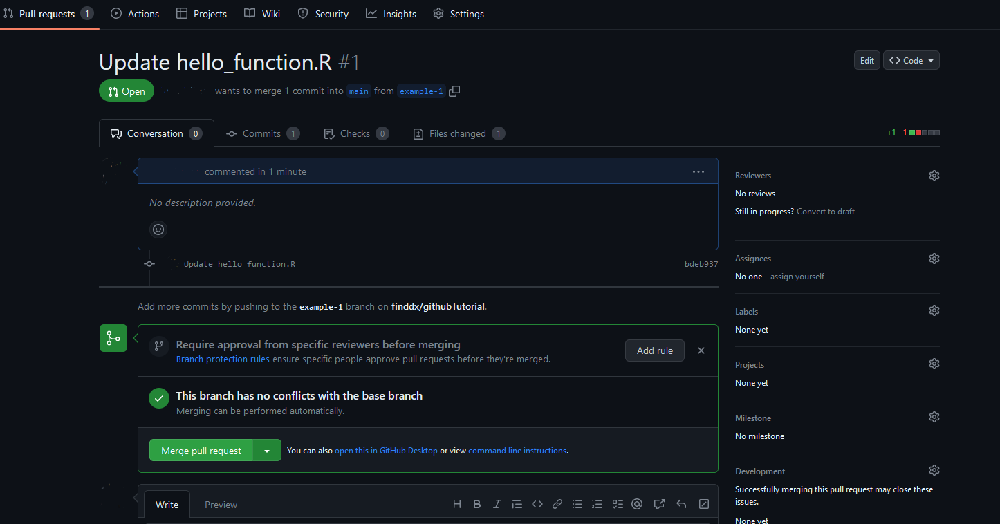
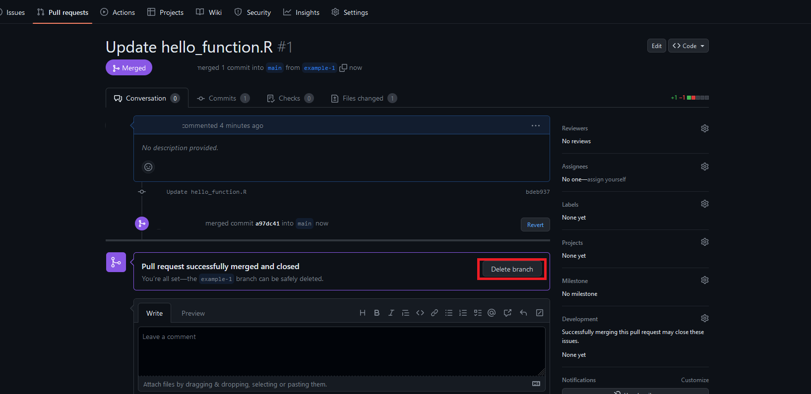
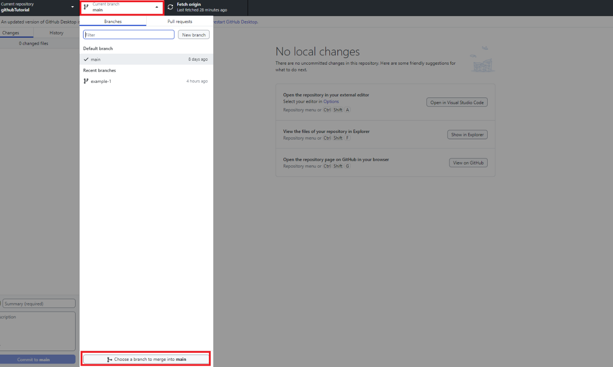

# **Introduction to Git and GitHub**

## **Naming conventions**

Repository names should be following the following conventions: **1) General repositories:** all lowercase with a - in between words e.g. find-validation-platform-aws-hosting, **2) Repositories for R packages or shiny applications:** all lowercase with no delimiter in between e.g. findcompositeindicator.

## **Main terminology**

**Git**: version control system that allows users work collaboratively
on a codebase workflow to track changes and manage different versions of
the files created during a codebase project. Git can be installed on a
local machine and be used via the command line.

**GitHub:** a web-based platform that uses a graphical interface for Git
that allows users to share, store, and collaborate remotely in public or
private projects.

**GitHub Desktop:** Windows/macOS graphical interface for Git that
allows users to perform Git commands without the command line interface.

**Repository:** a collection of files, folders, and version history
managed by Git. A repository usually contains:

-   The project files (of any type) and folders

-   A hidden folder called ".git" that contains the metadata of the
    changes made in the codebase project

-   All the commits, which represent a snapshot of the project files
    that were in the repository at a specific point in time. The commit
    objects also include a description of the changes made to the files.

-   All the branches, which represent multiple versions of the codebase
    project and allow working in multiple features by different users at
    the same time.

**Initializing a repository:** Create a new local Git repository or
initialize an existing directory.

**Staging:** Prepare the files to be committed to the repository.

**Committing:** Commit the changes to the repository (snapshot of the
changes).

**Pushing:** Push the committed local files to the online repository.
Updates the remote repository with the latest changes.

**Pulling:** Fetch the files of a remote repository to a local
repository. Updates the local repository with the latest changes.

**Cloning:** Clone a remote repository to a local machine.

**Branching:** Create new/secondary versions of the repository. This
allows working on new features of the codebase project without affecting
the files that are in the main branch of the repository.

**Merging:** Merge the changes from one branch into another (usually to
the main branch).

**\
**

## **Getting Started with GitHub**

The first step to using GitHub is to create an account. Go to
<https://github.com> and click on the "Sign up" button in the top
right corner. Enter all the information required (i.e., email, username,
password...) and click on "Create account".

## **Connecting to Git and GitHub Desktop**

As mentioned in the terminology, Git is a version control system that
allows tracking and managing all changes made to codebase projects. To
do so, you can use either Git, which is based on the command lines from
the terminal, GitHub Desktop, which is a graphical, and more
user-friendly, interface or RStudio which is a graphical interface for R that 
also permits to perform all the Git and GitHub operations directly on this 
interface. The use of one or another depends on which one you feel more 
comfortable with, but all are capable of performing the same tasks.

The tutorial shows screenshots of the whole process following as main
example GitHub Desktop because it is more user friendly and easy to
visualize. But it also includes the commands needed to perform the same
tasks in Git and RStudio. Please note, screenshots are taken using dark mode, 
you may see white backgrounds depending on your configuration.

#### ***GitHub Desktop***

You can download and install GitHub Desktop from
<https://desktop.github.com/>. Once installed, open the software, and
add your GitHub credentials (email and password) to connect to GitHub.

#### ***Git***

Access <https://git-scm.com/> to download and install Git. After
installation, run the following commands to connect to your GitHub
account:

`git config --global user.name "your name"`

`git config --global user.email "your.email@finddx.org"`

Please note, you may be asked for your GitHub password when pushing or
pulling changes from a remote repository.

#### ***RStudio***

If you are an R user you can also do everything directly in the RStudio 
interface. To do so, you need to first setup Git and GitHub as is mentioned 
above. Assuming you have R and Rstudio installed, you will need to install 
(install.packages()) and load (library()) the "usethis" and "gitcreds" 
libraries.

In Rstudio, go to “Tools”, “Global options” and then “Git/SVN” and make sure 
that the option version control interface for RStudio projects is enabled and 
that there is an executable path, usually is something like this:
“C:/Users/YOURUSERNAME/AppData/Local/Programs/Git/bin/git.exe. 
Click OK to return to RStudio.

{width="8.00in"
height="4.50in" style="display: block; margin: 0 auto;"}

To connect RStudio to Git, run the following commands in the Terminal 
(not the Console) using the user name and email you already setup in Git and 
GitHub:

`git config --global user.name "Your name"`
`git config --global user.email youremail@finddx.org`

Or you can also use the following command to run it directly from the Console:
`usethis::use_git_config(user.name="Your name", user.email="youremail@finddx.org")`

To avoid using a password each time you want to connect to git you can use:
`usethis::use_git_config(scope="user", credential.helper="store")`

Additionally, you will need to create a token in GitHub to connect to this 
platform. To do so, you can either type `usethis::create_github_token()` to be 
redirected to GItHub and create a token for the connection or go directly to 
<https://github.com/settings/tokens> and click on "Generate new token (classic)", 
in any case you will be launching the same page, and you will need to configure 
basic information about the permissions you want to grant to this connection. 
For this example, we are just granting permissions to do basic operations in 
the repository (commit, pull, push, etc.), but you could potentially grant 
additional admins permissions.

{width="8.00in"
height="4.50in" style="display: block; margin: 0 auto;"}

Once you have obtained the token, use the function 
gitcreds::gitcreds_set(url="https://github.com"), and specify github as the 
repository page. After running the command, you will be asked in the Console in 
RStudio to provide the token, simply pasted in the corresponding area and 
this will setup the connection.

**\
**

## **Creating a new repository (GitHub)**

It is possible to create a new repository from either GitHub, GitHub Desktop, 
Git, or RStudio (). In the steps below we are going to see how to do it using 
GitHub only, see "Creating a repository (GitHub Desktop, Git, and RStudio)" to 
do it using the those approaches.

#### ***GitHub***

To create a new repository on GitHub, click on the "New" button on the
GitHub dashboard or go to the GitHub page of the organization you want
to create a new repository, and on the "Overview" tab you should see a
"New" button.

Once you click on new you should see the below image, where you need to
give a name for the repository you are creating and an optional
description. It is also possible to choose whether to make the
repository public or private. Public repositories are visible to anyone,
while private repositories can only be accessed by authorized
collaborators. After this simply click on "Create repository".

{width="8.00in"
height="4.50in" style="display: block; margin: 0 auto;"}

And you should see now an empty repository.

{width="8.00in"
height="4.50in" style="display: block; margin: 0 auto;"}

**\
**

## **Cloning the repository**

To be able to work on a repository that is available in GitHub, it is
necessary to first clone the repository to a local machine. This will
create a local copy of all the files that are available online, so an user 
can make any local modifications of the files and code, and once the necessary 
modifications are made, push them into the GitHub remote repository.

To clone an empty repository, copy the URL that would appear on the new
repository page.

{width="8.00in"
height="4.50in" style="display: block; margin: 0 auto;"}

Or if you want to clone a repository with existing files, click on the
green "Code" button on the repository page, and then copy the URL.

{width="8.00in"
height="4.50in" style="display: block; margin: 0 auto;"}

#### ***GitHub Desktop***

In GitHub Desktop simply go to "File" then "Clone repository" and paste
the clipboard (GitHub repository address) in the "URL" tab that will
appear in the popup window. You should also select the location (local
path) where you want to store the repository and click on "Clone". You
can now go to the local path you chose, and you will see a folder with
the name of the repository you cloned.

{width="8.00in"
height="4.50in" style="display: block; margin: 0 auto;"}

#### ***Git***

Open the terminal and navigate to the directory where you want to store
the project (`cd /path to your directory/`). Then, run:

`git clone <paste the copied URL here>`

For this example, would look something like this:

`git clone <https://github.com/finddx/githubTutorial.git>`

#### ***RStudio***
To clone a repository, click on “File”, “New Project”, “Version Control” and 
then “Git” copy and paste the address of the repository, and automatically will 
popup the directory name, so you just need to select the folder where you want 
to store the repository locally. Once you click on "Create Project" a new tab 
called "Git" will appear in the top-right panel.

{width="8.00in"
height="4.50in" style="display: block; margin: 0 auto;"}

**\
**

## **Creating a repository (GitHub Desktop and Git)**

As mentioned above, it is also possible to first create a local
repository and then connect it to GitHub. The main difference between
first creating the remote repository in GitHub with creating it directly
on a local machine is that, unlike the first option, it is now no longer
necessary to clone the repository because it is already in the local
machine, but now it is necessary to connect the local repository with a
GitHub account to create the remote repository.

#### ***GitHub Desktop***

In GitHub Desktop you can create a repository simply by clicking on
"File" and "New repository", you will see a popup window like the one
below to add basic information about the repository such as name, the
location of the local repository, etc.

{width="8.00in"
height="4.50in" style="display: block; margin: 0 auto;"}

After creating a local repository you will see that you are now asked to
publish the repository to GitHub.

{width="8.00in"
height="4.50in" style="display: block; margin: 0 auto;"}

Click on "Publish repository" to link the repository to a GitHub
account.

{width="8.00in"
height="4.50in" style="display: block; margin: 0 auto;"}

#### ***Git***

To create a new Git repository, open the terminal (or command prompt)
and navigate to the location where the repository will be locally
created:

`cd /path to your directory/`

Then create a new directory for the repository (for this example, it is
called "githubTutorial"):

`mkdir githubTutorial`

And navigate into the new directory to initialize a new Git repository:

`cd githubTutorial`

`git init`

Now it will be necessary to create a repository in GitHub (follow the
steps from "Creating a new repository (GitHub)" until "Cloning a
repository") to connect it to the local repository. Please make sure
that the names of the repositories in both Git and GitHub are the same,
including lower- and upper-case letters.

Once the GitHub account is created will be necessary to copy the URL of
the GitHub repository to Git and run the command below (again, in this
example we are using a repository called githubTutorial that is stored
in the FIND GitHub account):

`git remote add origin https://github.com/finddx/githubTutorial.git`

You should then verify that the "origin" remote has been added
successfully:

`git remote -v`

If so, you should see something like this:

`origin https://github.com/your-username/githubTutorial.git (fetch)`

`origin https://github.com/your-username/githubTutorial.git (push)`

And then simply push the local repository to GitHub:

`git push -u origin main`

Note, depending on the GitHub repository, "main" could also be called
"master" as the default branch.

#### ***Rstudio***

In RStudio, you can simply type:

`usethis::use_github()` 

You can also specify parameters for the repository such as the organization, 
and its visibility:

`usethis::use_github(organization=”Organisation name”, visibility=”private”)`

**\
**

## **Making changes to the repository**

Once there is a local copy of a repository in a local machine, it is now
possible to start making changes to the code/files of the project. To do
so, simply open the script or file and do the modifications you need to
do. Once the work is finished save the new changes in the local
repository you are working on. You can also create/add new files to the
repository if you need to.

## **Committing changes**

Once the changes are made you need to stage and commit the changes so
this can be moved to the GitHub repository too. The staging process
refers to adding/preparing the files that will be committed to the
repository. The commit stage refers to taking a "snapshot" of the
changes that were made in the repository, so we can keep track of any
modifications.

#### ***GitHub Desktop***

In GitHub Desktop when there is no modifications the screen will look
like the image below, indicating there are "No local changes", you can
also observe that the left area indicates "0 changed files".

{width="8.00in"
height="4.50in" style="display: block; margin: 0 auto;"}

However, if we add a file or modify some pieces of the script, those
will be highlighted in the screen (green for all the information we add,
and red for the information we remove). For this example, we created a
new R project called github_tutorial that holds a hello function that
simply prints "Hello" + the name of the person. If we save this file, we
will observe that everything is in green because there are now new files
that did not exist before.

{width="8.00in"
height="4.50in" style="display: block; margin: 0 auto;"}

You can see that on the left area (image above) everything is
automatically selected, this indicates that all the files are now in the
staging phase, you can uncheck any boxes in case you do not want to
stage (and commit) all the files.

We then can proceed to commit the file. First, write a message (in
present tense) on the left-bottom area indicating the modifications that
were made, and an optional description to detail everything you did, so
all the users can better understand the changes that were made. In this
example due to it is the first commit, we can put something like
"Initial commit". After this, click on "Commit to main" to commit the
changes from the local repository to the remote repository in GitHub.

{width="8.00in"
height="4.50in" style="display: block; margin: 0 auto;"}

#### ***Git***

To move all the files to stage mode in Git simply run:

`git add .`

Where "." refers to selecting all the files, but you could also add
specific files. For example, if you just want to move a file called
"test.R" you could run this command:

`git add test.R`

After this, you could run git status just to verify that the files are
in stage mode.

Once the desired files are in stage mode, you need to commit them. To do
so, run the below command, note that you need to add a message (in
present tense) to the commit indicating the changes that were made, so
all the users that work on the project can relate to what the new
changes refer to.

`git commit -m "Add your commit message here"`

#### ***RStudio***

In RStudio, files that have been modified will appear in the top-right area.
In this area is possible to simply select the files to stage them and then 
click on "Commit".

{width="8.00in"
height="4.50in" style="display: block; margin: 0 auto;"}

Once you click on "Commit", a new window will popup allowing to add the commit 
message, and from here simply commit the files and a small pop up message 
will appear indicating the modifications made. As you may observe new 
modifications are highlighted in green while old version of the files are in 
red. The non-highlighted data indicates that they were not modifications.

{width="8.00in"
height="4.50in" style="display: block; margin: 0 auto;"}

**\
**

## **Pushing changes to GitHub**

Once files have been committed it is necessary to push them to
GitHub, so all the new modifications can be visible to the users that
have access to the repository.

#### ***GitHub Desktop***

Once you commit the changes in GitHub Desktop, a new message will appear
asking to push the changes to the remote repository, simply click on
"Publish branch" to push the files to the remote repository. You can
also observe that now it says "0 changed files", as all of them are now
committed.

{width="8.00in"
height="4.50in" style="display: block; margin: 0 auto;"}

If you now go to the GitHub repository, you will see the new
files/changes and all the information about the commit (i.e., commit
message, date of the commit, etc.).

{width="8.00in"
height="4.50in" style="display: block; margin: 0 auto;"}

#### ***Git***

In Git, to push the local changes into the GitHub repository simply run
the following command:

`git push origin main`

#### ***RStudio***

In RStudio, once files have been committed simply click on "Push" to move the 
files to the remote repository, a small popup will appear indicating the 
details of this action.

{width="8.00in"
height="4.50" style="display: block; margin: 0 auto;"}

Please note, you can do all these operations in the pop up window that appeared
after clicking on commit, or can be done directly in the "Git" tab 
(top-right area) in RStudio.

**\
**

## **Pulling changes from GitHub**

It is common that when working on a collaborative repository, multiple
users work and modify the files constantly. So, to keep track of the
changes made by other users (or a file that is updated automatically),
you need to pull those changes from the remote repository to the local
machine you are working on before making a new modification.

For this example, assume there is another user working on the same
repository who modified the hello function and added a welcome message
after the hello sentence. To do that, the user first of course cloned
the repository locally, and then committed and pushed the files to the
remote repository, so now we can see in GitHub the changes that this
person made.

{width="8.00in"
height="4.50in" style="display: block; margin: 0 auto;"}

#### ***GitHub Desktop***

Whenever there are new changes in the GitHub repository, GitHub desktop
would indicate there are committed changes that are not in the local
machine (if you are sure there are new changes, but do not see any
message in GitHub desktop simply click on "Fetch" in the ribbon area to
update the connection). To get the newest changes from the remote
repository to the local one, click on "Pull origin" and you will see
that the new modifications/files are now added to the local repository.

{width="8.00in"
height="4.50in" style="display: block; margin: 0 auto;"}

#### ***Git***

In Git, to pull changes simply run:

`git pull origin main`

#### ***RStudio***

To pull the files simply click on "Pull" either in the top-right corner or 
in the Git popup window, a new message will appear indicating the files that 
changed, once you return to Rstudio main interface you will observe that the 
script has bee updated.

{width="8.00in"
height="4.50in" style="display: block; margin: 0 auto;"}
**\
**

## **Working with branches**

Because GitHub is a collaborative platform, it may be cases when more
than one person is working on the same file at the same time or when the
new modifications need to be first validated by a third person to ensure
everything works as expected. In those cases, it is necessary to push
the new files and modifications into an independent "branch", which
basically is a clone of the main repository, plus the new modifications
that were made in the local machine. In that way, if someone modifies
something, the new modifications are in an independent branch and the
software running is not affected until is fully tested and ensure
modifications from other users are not overwritten until they have been
tested or approved.

In GitHub, you can create an empty branch by clicking on the "main"
branch filed and then a small window will pop up so you can put the name
of the new branch.

{width="8.00in"
height="4.50in" style="display: block; margin: 0 auto;"}

#### ***GitHub Desktop***

In GitHub Desktop you can simply go to "Current branch" in the upper
ribbon area and click on "New branch", from there put the name of the
new branch and click on "Create branch".

{width="8.00in"
height="4.50in" style="display: block; margin: 0 auto;"}

To create a new branch and add directly the new modifications, you need
of course to have new changes that have not been committed yet. Let's
say we change the "Hello Human Welcome to FIND" sentence, so we include
some exclamation signs and change the "W" to lower case, which will lead
to the following message "Hello Human! Welcome to FIND!". As you can see
in the image below, GitHub will then highlight in red the pieces of code
that will no longer exist and in green the pieces that were added.
Pieces or files that were not changed will not be highlighted. 

{width="8.00in"
height="4.50in" style="display: block; margin: 0 auto;"}

Then, you can of course commit those new changes to the remote
repository, but before that, we need to create a new branch, so these
new modifications do not overwrite anything from the main branch. In
this example, we created a branch called "example-1". To do that click
on main (see image below) and type the name of the new branch and click
on "Create new branch".

{width="8.00in"
height="4.50n" style="display: block; margin: 0 auto;"}

Select "Bring my changes to -name of the new branch-" and click on
"Switch branch"

{width="8.00in"
height="4.50in" style="display: block; margin: 0 auto;"}

Now you will see that the current branch is set to the new branch name,
and then you can commit and push the changes to the remote repository as
we already saw in the corresponding section. If you now go to the GitHub
repository you will see that the new branch is now live.

{width="8.00in"
height="4.50in" style="display: block; margin: 0 auto;"}

#### ***Git***

In Git, there are two ways to create a new branch:

`git branch \<branch-name\>` creates a new branch, but it does not switch
to it.

`git checkout -b \<branch-name\>` creates a new branch and switches to it.

But if you have already modified some files and want to switch and move
those uncommitted changes directly to a new branch, run the following
command:

`git switch -c \<branch-name\> -m`

#### ***RStudio***
In RStudio, click on the icon highlighted in the image below a type the name for
the new branch, you can select "Sync branch with remote" to add the branch 
automatically in the remote repository.

{width="8.00in"
height="4.50in" style="display: block; margin: 0 auto;"}

**\
**

## **Merging branches**

#### ***GitHub***

Once you decided the information from the new branch is without issues
and ready to be part of the main code, you can go to the GitHub
repository and merge it to the "main" or "master" branch. Usually this
is done by a third user, but it can also be made by the same user who
created the new changes if the settings of the repository allow it. To
merge a new branch with the main branch, go to the remote repository and
you will see a message indicating "Compare & pull request" and simply
click on it.

{width="8.00in"
height="4.50in" style="display: block; margin: 0 auto;"}

A new window will appear with several pieces of information (see image
below). It will indicate whether those branches are "Able to merge"
(i.e., there are no conflicts) and you will also be able to write a
message (if any) about the merger process. Before clicking on "create
pull request", if you scroll down you will see that GitHub is comparing
the modifications made as we previously saw when we created this new
branch in GitHub Desktop (new additions are in green and deleted
information is in red).

{width="8.00in"
height="4.50in" style="display: block; margin: 0 auto;"}

After clicking on "Create pull request", a new window will appear
validating this merge and if no issues arises, it would indicate there
are not conflicts and you will be free to merge ("Merge pull request"
button and then confirm merge).

{width="8.00in"
height="3.30in" style="display: block; margin: 0 auto;"}

Once the merging is finished, you will be asked if you want to delete
the temporal branch, simply click on "Delete branch".

{width="8.00in"
height="4.50in" style="display: block; margin: 0 auto;"}

Note that GitHub keeps track of any change, so if you click on the main
branch field you can access all closed (and open) branches and restore
them if necessary.

## **Merging a branch locally**

#### ***GitHub Desktop***

To merge a branch locally, go to the branch (Current branch tab) where
you want to merge another branch (usually main or master). Then click
again in the "Current branch" tab and click on "Choose a branch to merge
into -branch name-" .

{width="8.00in"
height="4.50in" style="display: block; margin: 0 auto;"}

Select the branch you want to merge into the current branch and click on
"Create a merge commit". Then, you can simply push the commit to the
remote repository.

{width="8.00in"
height="4.50in" style="display: block; margin: 0 auto;"}

#### ***Git***

In Git, it will be necessary to checkout the branch where you want to merge 
another branch (usually main or master) using the command 
`git checkout -branch name(main or master)-`, and run the merge command with 
the name of the branch you want to merge: `git merge -branch name to merge-`, 
for this example, would be: `git merge example-1`. Then, you will need to 
stage, commit, and push to the remote repository.

#### ***RStudio***
Rstudio does not allow to easily merge branches directly in the platform. 
However, this can be achieved directly in GitHub or through the git4r library.

**\
**

## **Dealing with conflicts**

Collaborative project involves sometimes different users working on the
same piece of code and coming up with different approaches for the same 
solution. This will of course create conflict because we would have two 
(or more) branches with different versions of the same file.

Sometimes, we can integrate the different solutions as part of the main
project or use some parts of each solution to create a new one, but in
most cases it will be necessary to choose only one solution and remove the
others. Whatever the case, we need to take decisions and use just the
part of the code we want to integrate into our main project.

#### ***GitHub Desktop***

When there is a conflict, GitHub will immediately highlight these issues
with the conflict markers: \<\<\<\<\<\<\<HEAD "conflict code branch 1"
======= "conflict code branch 2" \>\>\>\>\>\> along with the name of the
commit where the issue is present (see image below).

{width="8.00in"
height="4.50in" style="display: block; margin: 0 auto;"}

What you need to do is to open the file where there
is a conflict; here for example: \<\<\<\<\<\<\< HEAD
print(paste(\"Hello\", name,\"!\", \"welcome to FIND!\")) =======
print(paste(\"Hello\",name)) \>\>\>\>\>\>\> parent of 11a1c61 (Add
welcome sentence to hello_function.R) }, and to solve it, we simply keep
the piece of code we want to retain: print(paste(\"Hello\", name,\"!\",
\"welcome to FIND!\")) and remove the part of the script that we want to
remove: \<\<\<\<\<\<\< HEAD ======= print(paste(\"Hello\",name))
\>\>\>\>\>\>\> parent of 11a1c61 (Add welcome sentence to
hello_function.R) }.

{width="8.00in" 
height="4.50in" style="display: block; margin: 0 auto;"}

Then you will need to commit the new changes and push them to the remote
repository as we already saw.

#### ***Git***

In Git, you will need to identify the files that have conflict using 
`git status`, and as was mentioned for GitHub Desktop, open the conflicted 
file to look for the conflict markers (\<\<\<\<\<\<\<HEAD "conflict code 
branch 1" ======= "conflict code branch 2" \>\>\>\>\>\>). Edit the file, 
keeping the piece of code you want to retain, and then simply stage, commit 
and push the changes to the remote repository.

#### ***Git***
RStudio will highlight (in green) the pieces of code that have a conflict (
<<<<<<< HEAD conflict code branch 1 ======= conflict code branch2 >>>>>>>),
and you will need to manually open that file and keep part of the script
you want to preserve. COnflict markers also need to be removed manually.
Once, resolved you simply need to commit and push the files to the remote 
repository.

{width="8.00in" 
height="4.50in" style="display: block; margin: 0 auto;"}

**\
**

## **Restoring a file on a specific commit (checkout)**

As mentioned throughout this tutorial, it is always possible to go back
to a previous version of a commit in case the new version of the code
does not work as expected or simply because you want to check a
previous version for any specific reasons.

#### ***GitHub Desktop***

Go to the left sidebar and click on the "History" tab, right click on
the commit you want to restore and click on "Revert changes in commit".
As you may see, it is also possible to create a new branch from a
specific commit (Create branch from commit).

{width="8.00in"
height="4.50in" style="display: block; margin: 0 auto;"}

#### ***Git***

In git, you would need to first find the "hash" (id) of the commit you
want to restore, you can do this using:

`git log \-- file-name`

Then you need to use `git checkout commit-hash -- filename` to restore the
file to the state on that specific commit.

Note that the "checkout" command is also used to switch between branches
in Git (see Working with branches of this tutorial)

#### ***RStudio***

In RStudio open the Git window and select "History" in the ribbon area. You 
will see all the commits history and some related metadata. Click on the commit 
you want to restore and open the file, then you can simply click on "Save as" 
to overwrite the file to the old version selected. Please note that you can also
click on the "Revert" button, but this will only retrieve the previous 
non-committed file.

{width="8.00in"
height="4.50in" style="display: block; margin: 0 auto;"}
**\
**

## **Tagging users and creating issues in GitHub**

As we already saw, other users can work on a specific project and make
modifications to the repository. But to have a better control of this we
can add or restrict the access to specific users, create issues so users
can create or fix a specific piece of code, or tag them to notify about
certain issues they need to check.

To add/restrict access, go to the GitHub repository, and then to the
settings tab (please note, to do this you will need to have admin
rights). Go to members and teams, and search for the GitHub username you
want to add. You can assign specific roles to the users such as Admin,
Write, and Maintain. It is also possible to add Teams or remove members.

{width="8.00in"
height="4.50in" style="display: block; margin: 0 auto;"}

It is also possible to create a new issue, so we can have better control
over what each user is doing. To do that, go to the issues tab and
simply click on "New issue". In this area, it is possible to add a title
for the issue, write a message, but also to assign specific users to the
user so they can be notified of specific task they need to work on.

{width="8.00in"
height="4.50in" style="display: block; margin: 0 auto;"}

Once the issue is resolved (and the user committed and pushed the
changes to the remote repository), the user can simply click go to the
issue and click on close issue, so it is no longer listed as open. But
remember, because Git keeps track of all the changes, the issue can be
re-open if necessary.

**\
**

## **Final Recap**

The image below provides a general recap of how the Git process
workload. The first step is to move (add) the files from the local
working area to the staging phase, so we can commit and push the files
from the local repository to the remote repository, and in the opposite
way, we need to pull the files from the remote repository to the local
repository to keep all the local files up to date. Checkout allows
switching between repository versions or branches.

{width="8.00in"
height="4.50in" style="display: block; margin: 0 auto;"}

Image source: <https://github.com/szalam/gitwintut>
